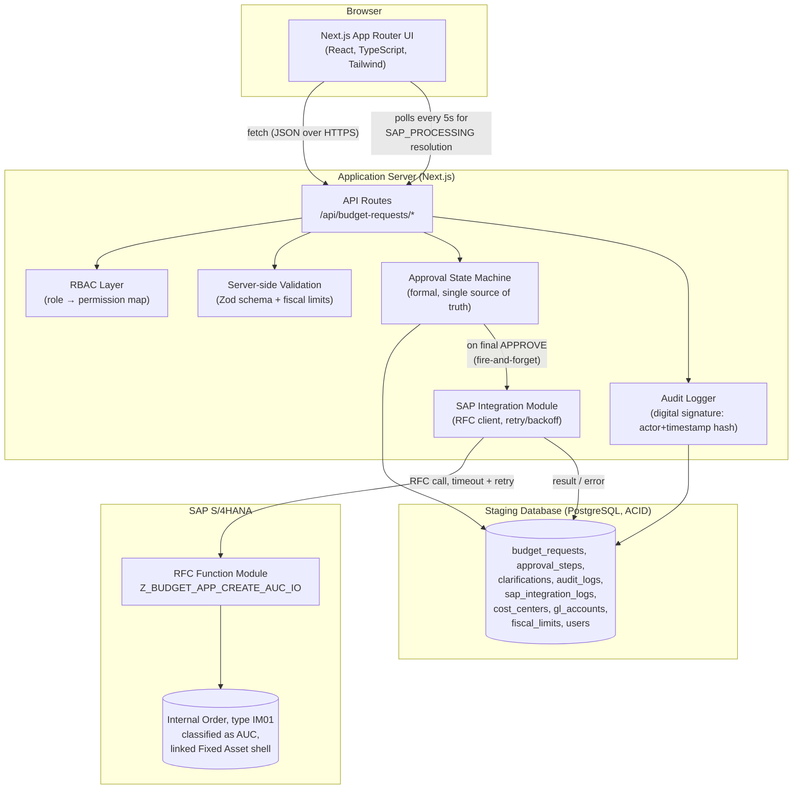
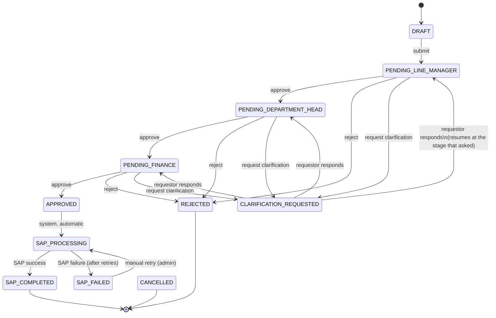

# Architecture

City Cement Budget Approval App — a decoupled web application that lets
business users initiate and approve CapEx budget requests, then automatically
creates the corresponding Asset Under Construction (AUC) Internal Order in
SAP S/4HANA once the request clears the full approval chain.

## High-level architecture

## Why this shape

**Decoupled frontend / backend, staged through a database.** The browser
never talks to SAP directly, and SAP never talks to the browser. Every
request is staged in PostgreSQL first — fully ACID, so a request can never
be left half-approved or half-posted even if the process crashes mid-write.
The Next.js API routes are the only thing that touches both the database and
the SAP RFC layer, which keeps the SAP credentials, connection pooling, and
retry policy server-side only.

**Formal state machine, not ad-hoc status flags.** `src/lib/state-machine.ts`
is the single place that knows which status transitions are legal and who is
allowed to trigger them. API routes call into it rather than writing
`status` directly, so the data in `budget_requests` can never drift into an
unreachable state — see the transition diagram below.

**Fire-and-forget SAP posting.** The approver's HTTP request returns as soon
as the approval is recorded; SAP posting happens asynchronously
(`void processApprovedBudget(requestId)`), with status surfaced through
`SAP_PROCESSING → SAP_COMPLETED/SAP_FAILED` and the UI polling for it. This
keeps approval actions fast and resilient to SAP latency or downtime.

**Mock-mode SAP connector that's structurally identical to production.**
`SAP_MOCK_MODE=true` (the default in this repo) simulates the RFC call with
realistic latency and occasional injected failures, exercising the same
retry/timeout/error-classification code path that the real `node-rfc`
connector uses — see `docs/sap-integration.md`.

## Approval state machine

`REJECTED`, `SAP_COMPLETED`, and `CANCELLED` are terminal — no further
transitions are defined out of them.

## Tech stack

| Layer | Choice | Why |
|---|---|---|
| Frontend | Next.js (App Router) + React + TypeScript + Tailwind | Server components for auth/data-fetching, client components for interactive forms; one deployable artifact, no separate frontend build pipeline. |
| API | Next.js Route Handlers | Co-located with the frontend, but cleanly separable behind an API Gateway later (see "Strategic Implementation Advice" in the README) without touching workflow logic. |
| Database | PostgreSQL via Drizzle ORM | ACID-compliant staging store, exactly as required — approvals are committed transactionally before anything is pushed to SAP. |
| Validation | Zod | Schema + business-rule (fiscal limit) validation runs server-side regardless of what the client sends. |
| SAP integration | RFC (via `node-rfc` in production, mocked here) | RFC is the standard low-latency synchronous integration pattern for this kind of "create and confirm" SAP call; see `docs/sap-integration.md`. |
| Auth | Signed-cookie demo session | Stands in for Azure AD / SSO — every API route depends only on `getCurrentUser()`, so swapping the identity provider is a one-file change (see README). |
